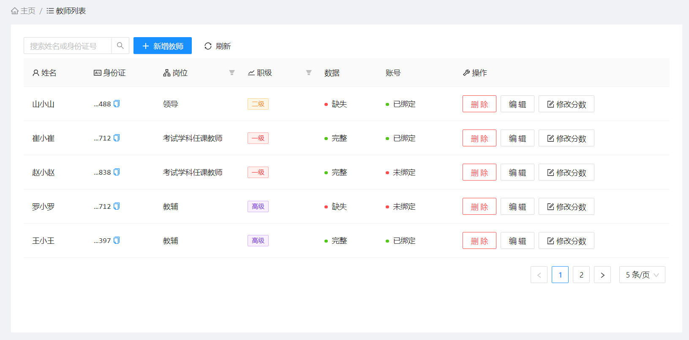
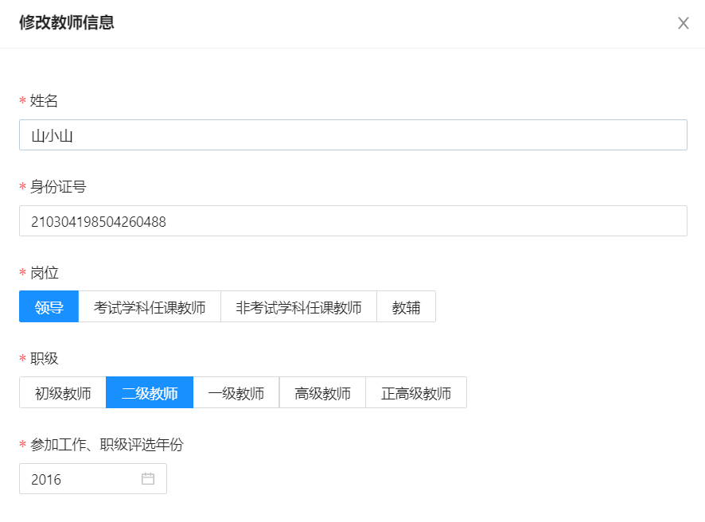
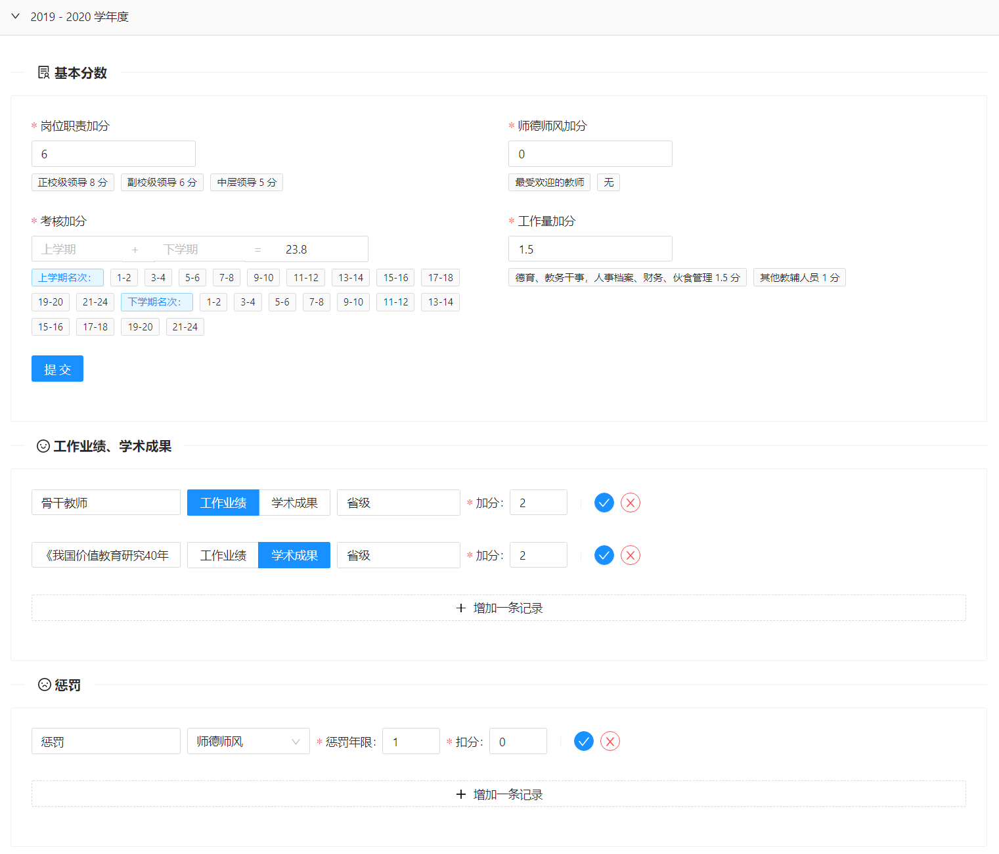
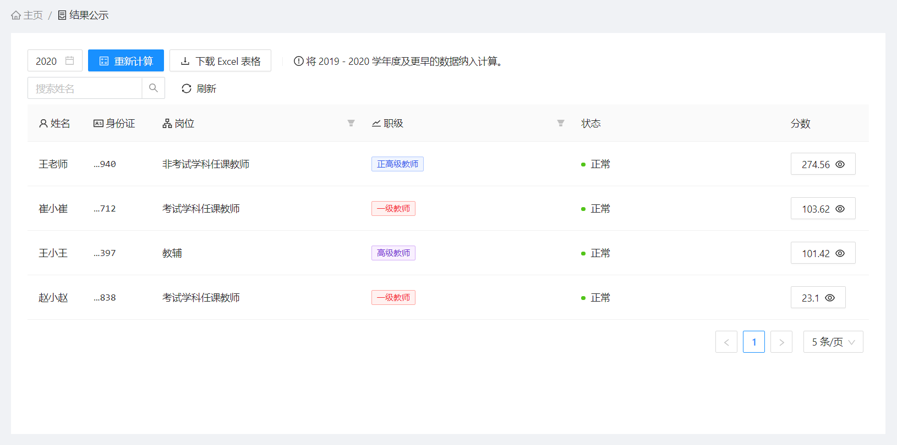
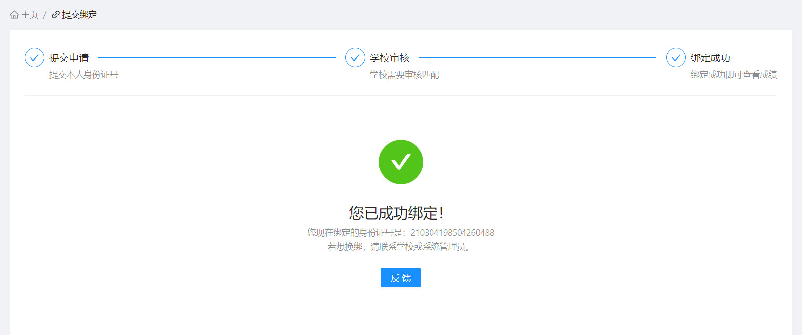
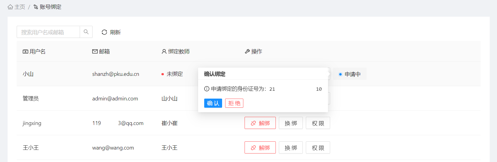
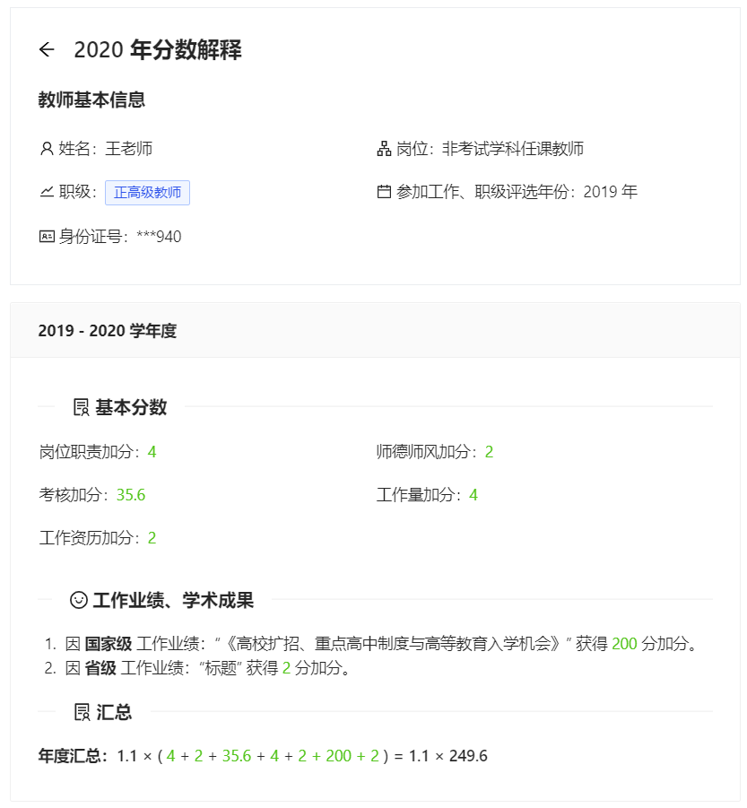
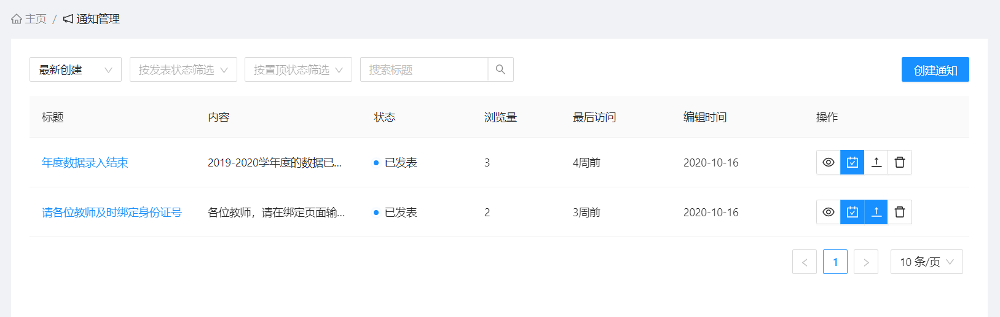
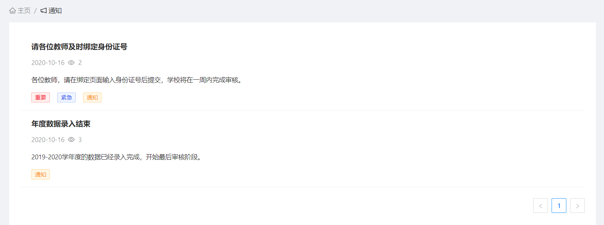
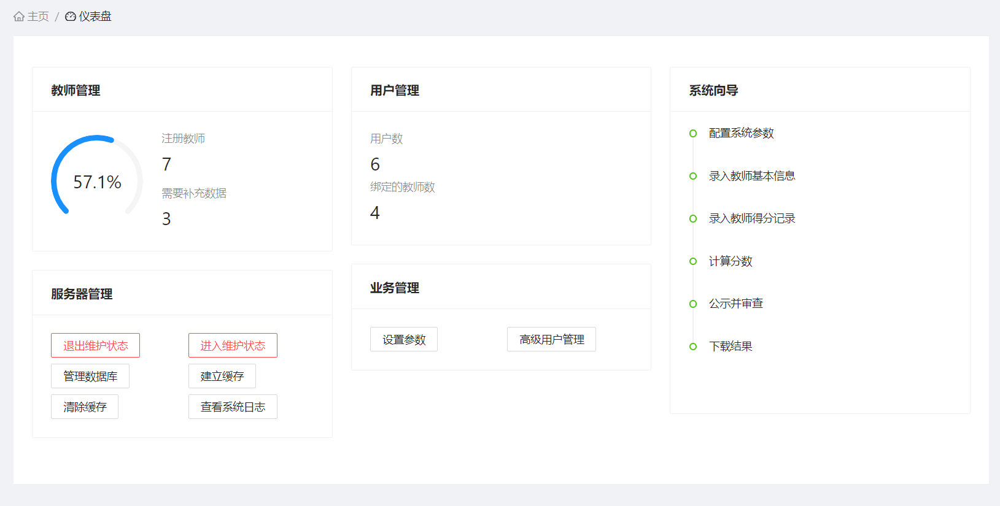

# TMSys. 教师绩效管理系统

👩‍🏫 一个基于 React、Ant Design 与 Laravel 的轻量级教师绩效管理系统。

基于《中小学教师职务评聘的长效考核机制》开发，设置责任明确的管理权限，每学期结束时对各项考核指标进行量化，量化结果公开，逐年累计，职务晋升时依据量化排名依次确定晋升人员。

## 教师信息管理

**教师信息管理：**

✨ 可即刻查看缺失的数据和账号绑定情况，支持基于姓名和身份证号的搜索。

**教师信息编辑：**

✨ 支持身份证号合法性、唯一性自动查验，防止出错。

## 教师成绩管理

**教师成绩编辑：**

✨ 可编辑逐年分数，记录奖惩信息。支持输入提示，根据各学校不同制度随时调整。

**学年成绩生成：**

✨ 生成后将结果保存，作为存档。支持 xlsx 文件输出。

## 教师账号绑定

✨ 教师可注册账号，查看本人成绩及同校教师排名。校方统一进行账号绑定审核。

**教师申请绑定：**

**校方审核：**

**分数解释：**

## 通知系统

**校方发布通知：**

**教师查看通知：**

## 系统管理

**管理员仪表盘界面：**

## TODO：

- 移动端的适配
- 同校教师信息查看
- 教育局管理
- 教师反馈、评论功能
- 微信登录
- ...
